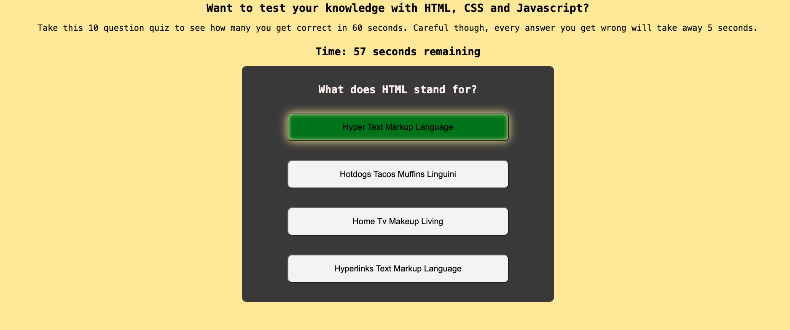

# 04-Code-Quiz

LIVE URL:👇🏼 
https://samamiraa.github.io/04-Code-Quiz/

## Description

I was very overwhelmed with Javascript, I thought Web API's broke my brain. This actually motivated me to understand how to make everything work. I built this assignment to help solidify my understanding. I am a hands on learner, so applying my knowledge into this project helped. I learned the console log is your bestfriend to help debug your code!

## Installation

N/A

## Usage

First you will start at the start screen 
 
 
 
To start the quiz, press start quiz button and it will take you to the first question. 
 
 
 
When you get an answer correct, the background color for the answer will turn green. Then go automatically to the next question. 
 
 
 
When you get an answer wrong, the background color will change to red and 5 seconds will subtract from the timer. 
 
 
 
After you answer all 10 questions or if the timer reaches 0, you will be directed to save your score and input your initials 
 
 
 
Once you hit save score, your initials plus your score will display on the screen. 
 
 
 
If you hit restart, the page will reload and take you back to the start screen. 
 
 
 
You can also view the last highscore by clicking the "view last high score" button. 
 
 
 
Then it will take you to another page that will display the last high score. 
 

## Credits

Thank you to my tutor Andrew, who helped me when I was stumped. I also referred to our class lessons/class recordings.

https://www.udemy.com/course/build-a-quiz-app-with-html-css-and-javascript/learn/lecture/13703646#overview
https://stackoverflow.com/questions/54637148/how-to-add-onclick-event-to-start-timer
https://www.w3schools.com/jsref/jsref_foreach.asp
https://stackoverflow.com/questions/68421164/countdown-timer-only-counts-down-1-second-then-stops
https://www.w3schools.com/jsref/met_win_clearinterval.asp
https://stackoverflow.com/questions/14666924/clearinterval-not-working#:~:text=You're%20using%20clearInterval%20incorrectly.&text=The%20problem%20sometimes%20may%20be,static%20solution%20may%20be%20harmful.
https://developer.mozilla.org/en-US/docs/Web/API/setInterval
https://www.youtube.com/watch?v=AUOzvFzdIk4

## License

The MIT License is short and to the point. It lets people do almost anything they want with your project, like making and distributing closed source versions.

---

## Badges

N/A

## Features

N/A

## How to Contribute

N/A

## Tests

Take the quiz and save your score!